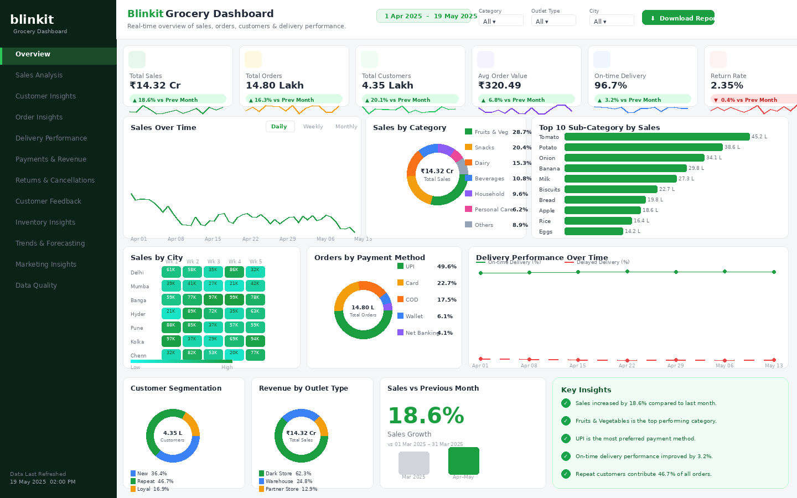

# 🛒 Blinkit Grocery Sales Analytics Dashboard

> A modern, interactive Grocery Sales Analytics Dashboard built with HTML, CSS, JavaScript, Chart.js, SQL, and Excel — transforming raw retail data into actionable business insights.



---

## 📊 Dashboard Highlights

| Feature | Description |
|---|---|
| 💰 **Sales & Revenue Tracking** | Total Sales KPI with MoM growth comparison |
| 📦 **Order & Customer Insights** | Orders, AOV, customer segmentation breakdown |
| 🌡️ **Interactive Heatmaps** | City × Week sales heatmap with gradient intensity |
| 🍅 **Category & Sub-Category Analysis** | Donut charts + top-10 horizontal bar chart |
| 🚚 **Delivery Performance** | On-time vs Delayed dual-line trend chart |
| 💳 **Payment Mode Analytics** | UPI, Card, COD, Wallet, Net Banking distribution |
| 👥 **Customer Segmentation** | New vs Repeat vs Loyal customer split |
| 🏪 **Outlet Type Revenue** | Dark Store vs Warehouse vs Partner Store breakdown |
| ⚡ **Dynamic Filters** | Category, City, Outlet Type, Date Range filters |
| 📈 **Sparkline Trends** | Mini trend lines inside every KPI card |

---

## 📌 Key Business Insights

- 📈 Sales grew **18.6% MoM** — from ₹12 Cr (March) to ₹14.32 Cr (April–May)
- 🍅 **Fruits & Vegetables** is the #1 category at 28.7% share — led by Tomato (45.2L)
- 💳 **UPI** dominates payment methods at 49.6% of all orders
- 🚚 **On-time delivery rate** improved to 96.7% (+3.2% vs previous month)
- 🔁 **Repeat customers** account for 46.7% of all orders, driving revenue loyalty
- 🏙️ **Delhi & Mumbai** are consistently high-sales cities across all weeks
- 🏪 **Dark Stores** generate 62.3% of total revenue — the primary fulfillment channel

---

## 🛠️ Tools & Technologies

| Tool | Usage |
|---|---|
| **HTML5 / CSS3** | Dashboard structure, layout, responsive design |
| **JavaScript (ES6+)** | Dynamic charts, interactivity, data rendering |
| **Chart.js 4.4** | Line, Bar, Donut, Sparkline charts |
| **SQL (PostgreSQL)** | Data extraction, KPI queries, aggregations |
| **Excel / CSV** | Raw data source and initial data cleaning |
| **Power BI** (concept) | Dashboard design reference and BI storytelling |

---

## 📁 Project Structure

```
blinkit-grocery-dashboard/
│
├── index.html              ← Main interactive dashboard
│
├── data/
│   └── grocery_sales.csv   ← Sample sales dataset (25 records)
│
├── sql/
│   └── queries.sql         ← All SQL queries powering the dashboard KPIs
│
├── assets/
│   └── preview.png         ← Dashboard screenshot (add manually)
│
└── README.md
```

---

## 🚀 How to Run

1. **Clone the repository**
   ```bash
   git clone https://github.com/YOUR_USERNAME/blinkit-grocery-dashboard.git
   cd blinkit-grocery-dashboard
   ```

2. **Open the dashboard**
   ```bash
   # Simply open in your browser — no build step required
   open index.html
   # Or on Windows:
   start index.html
   ```

3. **Explore SQL queries**
   - Open `sql/queries.sql` in any SQL editor (DBeaver, pgAdmin, MySQL Workbench)
   - Connect to your database and run the KPI queries against your own data

4. **Use the sample CSV**
   - Load `data/grocery_sales.csv` into Excel or your SQL database
   - Use it to practice data cleaning and analysis

---

## 📐 Dashboard Architecture

```
Raw Data (CSV/Excel)
        ↓
SQL Aggregations (queries.sql)
        ↓
KPI Calculation (Sales, Orders, AOV, Delivery Rate, Return Rate)
        ↓
Chart.js Visualizations (Donut, Line, Bar, Heatmap, Sparkline)
        ↓
HTML/CSS Dashboard (Sidebar + Topbar + Filters + Charts)
```

---

## 📈 Dashboard Sections

### 1. KPI Cards (Top Row)
Six metric cards with sparklines and MoM % change badges:
- Total Sales · Total Orders · Total Customers
- Average Order Value · On-time Delivery · Return Rate

### 2. Sales Over Time
Line chart with **Daily / Weekly / Monthly** tab toggle showing ₹ sales trend from Apr 1 – May 19.

### 3. Sales by Category
Donut chart with 7 categories and percentage breakdown.

### 4. Top 10 Sub-Categories
Horizontal bar chart — Tomato (#1 at ₹45.2L) through Eggs (#10 at ₹14.2L).

### 5. Sales by City Heatmap
7-city × 5-week grid with green gradient intensity encoding — instantly reveals peak sales periods.

### 6. Orders by Payment Method
Donut showing UPI dominance (49.6%) across 5 payment modes.

### 7. Delivery Performance
Dual-line chart (on-time vs delayed %) showing improvement over the period.

### 8. Customer Segmentation
New (36.4%) vs Repeat (46.7%) vs Loyal (16.9%) customer split.

### 9. Revenue by Outlet Type
Dark Store · Warehouse · Partner Store revenue contribution.

### 10. Sales Growth & Key Insights
18.6% growth bar + 5 auto-generated business insights panel.

---

## 🎨 Design Principles

- **Blinkit Brand Colors** — Primary green (#1a9e3f), supporting yellow, orange, blue, purple
- **Plus Jakarta Sans** — Display font for headings and KPI values
- **DM Sans** — Clean body font for labels and legends
- **Responsive Layout** — Adapts to 1200px, 768px, and mobile breakpoints
- **Dark Sidebar** — Professional BI-style navigation with active state highlighting

---

## 🤝 Connect

If you found this project useful, feel free to ⭐ star the repo and share it!

Built with ❤️ as a Data Analytics Portfolio Project.

---

*Dashboard data is simulated for portfolio demonstration purposes.*
